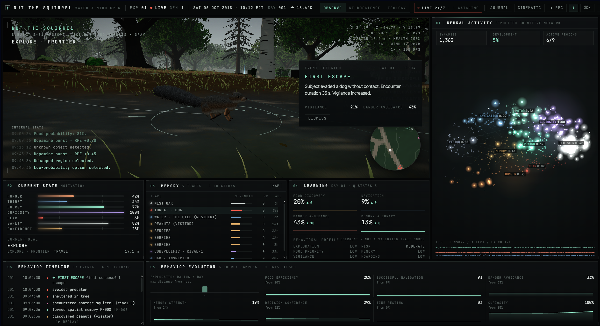
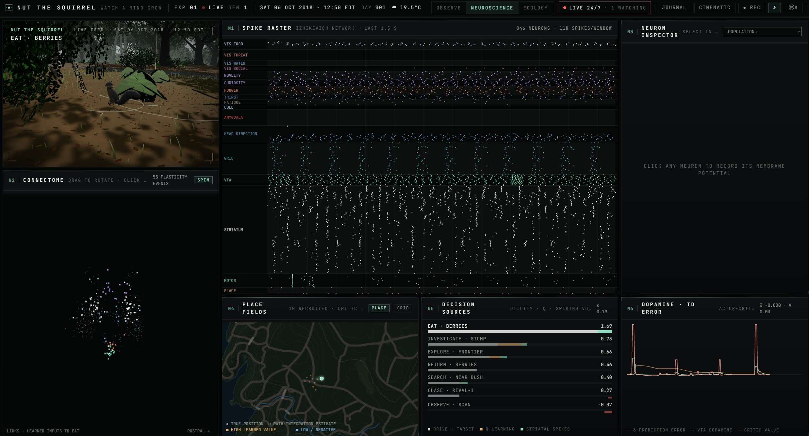

<div align="center">

# 🐿️ Nut the Squirrel

### Squirrel Lab: Watch a Mind Grow

**An artificial squirrel with a spiking neural brain, living in a real-data Central Park. Live 24/7.**

[](https://neural-squirrel.onrender.com)
[](https://neural-squirrel.onrender.com)

[](https://neural-squirrel.onrender.com)

<sub>Observe mode: the live 3D feed, Nut's drives and memories, and the spiking brain lighting up in real time.</sub>

**[▶ Watch Nut live →](https://neural-squirrel.onrender.com)**

</div>

---

Meet **Nut**, an eastern gray squirrel with diamond paws: she stacks acorns through every winter and never sells her caches.

An observation lab for an autonomous artificial squirrel living in a real place: **The Ramble, Central Park, New York**, starting on **6 October 2018**. The squirrel runs on a spiking neural network with dopamine-modulated plasticity, place and grid cells, and sleep replay. It forages, caches, drinks, sleeps in dreys, escapes dogs and red-tailed hawks, and competes with resident squirrels. You don't control it. You watch, for minutes or for weeks.

## Real-world data

| Real data (fetched once, bundled in `src/real/data`) | Published science |
| --- | --- |
| Terrain: USGS 3DEP via AWS Terrain Tiles | Kleiber energy budget + thermoregulation |
| Land cover, paths, water, buildings, names: OpenStreetMap | Izhikevich neurons (2003/2007) |
| Hourly weather Oct 2018 – Jun 2019: Open-Meteo ERA5 (temperature, rain, snow depth, wind, cloud) | STDP (Song et al. 2000) + dopamine TD learning (Frémaux et al. 2013) |
| Sun and moon positions, DST calendar: NOAA equations, lunar ephemeris | Grid-cell module ratio √2, 8 Hz theta, reverse replay |
| Behaviour rates, fur morphs and 251 local sightings: 2018 Central Park Squirrel Census | Scatter-hoarding, olfactory cache recovery, cache bequeathal |

The subject's behaviour is scored continuously with the census volunteers' categories (foraging, eating, running, climbing, above ground, chasing, tail twitches and flags, kuks). A daily calibration nudges drive biases toward the real rates. The **realism** score shows how close it gets.

To refresh the real data: `npm run data:fetch` (needs internet access, only once).

## Run

```bash
npm install
npm run dev        # http://localhost:3000
npm run build && npm start
```

### Modes

- **OBSERVE:** 3D feed, cognitive network, drives, memories, learning, timeline, evolution charts, minimap.
- **NEUROSCIENCE:** live spike raster of all 846 neurons, rotating connectome, neuron inspector with membrane-potential recording, place fields and grid-cell rate maps, decision sources (drive vs. Q-learning vs. striatal spikes), dopamine / TD error, sleep-replay log.
- **ECOLOGY:** interactive site map with hillshade, 1 m contours, OSM land cover, cognitive map, danger, caches, place cells, census sightings, squirrels, predators, trail and events. Includes pan/zoom, click-to-inspect and a time-lapse scrubber. Also: the real weather record, population and lineage, census calibration, data provenance and the field journal.
- **CINEMATIC:** letterboxed automatic camera director with REC.

<p align="center">
  <a href="https://neural-squirrel.onrender.com"></a>
  <br />
  <sub>Neuroscience mode: every spike of all 846 neurons, place fields, what drove each decision, and dopamine prediction errors.</sub>
</p>

### Keys

| Key | Action |
| --- | --- |
| `Space` | start / pause |
| `1` `2` `3` | Observe / Neuroscience / Ecology |
| `[` `]` | shorter / longer simulated day (real time … 100×) |
| `Ctrl/⌘ K` | command palette |
| `J` | field journal |
| `,` | settings |
| `C` | cinematic |
| `M` | map overlay |
| `D` | raw data panel |
| `O` | 3D overlays |

## Long-running experiments (days to weeks)

- **Day length.** Choose from REAL TIME (one simulated day = 24 h), 1 DAY = 6 H, 1 DAY = 1 H, up to 100×.
- **Autosave.** The complete experiment (world, buried-nut field, memories, synapses, place cells, lineage, journal, trail) is saved to IndexedDB every minute and when the tab closes. It resumes on the next visit.
- **Offline catch-up.** The time you were away is simulated on resume, up to 30 days. While the tab is hidden, a background driver keeps the experiment running.
- **Snapshots.** Export or import the full state as JSON from Settings.
- **Server mode.** Keeps an experiment alive without a browser:

  ```bash
  npm run lab:server -- --port 4317 --speed 1 --seed 728491
  ```

  The server saves to `data/lab-server-save.json` every minute, catches up after downtime, and serves `/api/status`, `/api/snapshot`, `/api/journal` and `POST /api/control`. In the lab, open **Settings → Server mode → Connect** to attach and mirror it.
- **Generations.** When the subject dies (starvation, exposure, predation), a yearling from the lineage takes over its range. The successor inherits mutated innate synaptic biases, temperament and the parent's caches, but not its learned place map or values.
- **Seasons.** Real weather brings frost, snow cover (hides surface food; caches are still found by smell), storms that fell trees (the map and memories become wrong), and rain that swells the water.

## Live 24/7 deployment

The public site is a spectator lab. One always-on server runs a single experiment 24/7, and everyone watches the same squirrel. Visitors can't start, pause or reset anything.

How it works:
- `scripts/lab-server.ts` runs the simulation, saves it every minute and serves the site.
- Each visitor downloads the current state once (~200 KB) and then runs an exact copy locally. The simulation is deterministic, so the copy stays identical to the server.
- Every 15 s the browser checks time, generation and position against `/api/live`, and only re-downloads if something differs. Rendering happens on each visitor's GPU, so the server stays light no matter how many people watch.

Build and run the live version locally:

```bash
npm run build:live     # static spectator site → out/
npm run start:live     # server + site on http://localhost:4317
```

### Free hosting on Render

The server is light: at the default speed it uses about 0.2% of one CPU core, so Render's free plan is enough.

1. Sign up at render.com with your GitHub account.
2. Choose **New → Blueprint**, pick this repository and confirm. Render reads `render.yaml`, builds the site and starts the server. Every push to `main` redeploys it.
3. Keep it awake. Free Render services sleep after 15 minutes without visitors.
   - Add a free monitor at uptimerobot.com (or cron-job.org) that visits `https://<your-service>.onrender.com/healthz` every 5 minutes.
   - As a backup, add the GitHub repository variable `LIVE_URL`. The *keep-alive* workflow then also visits the lab every 10 minutes.
4. Optional, recommended: keep the experiment across restarts. Free services have no disk, and redeploys restart the server.
   - Create a free Hugging Face account and a private **dataset** (e.g. `your-username/neural-squirrel-save`).
   - Create a write token.
   - In the Render service's **Environment** settings, set `HF_TOKEN` and `HF_SAVE_REPO`.
   - The server saves there every 30 minutes and resumes from it after a restart.

### Any always-on machine

For example an Oracle Cloud *Always Free* VM:

```bash
docker compose up -d   # site on port 80, experiment saved in a Docker volume
```

### Server settings

The server reads these environment variables:

| Variable | Meaning |
| --- | --- |
| `LAB_SPEED` | Default `1` = one simulated day per 8 minutes. `0.00555` = real time. |
| `LAB_SEED` | Seed for a new experiment. |
| `LAB_SAVE` | Path of the save file. |
| `LAB_ADMIN_KEY` | Enables `POST /api/control` (header `x-admin-key`) to change speed or pause. |

### Headless tools

```bash
npm run sim:headless -- 728491 10         # seed, days: metrics per day + milestones
npm run sim:trace -- 728491 300 5         # seconds, sample interval: decision trace
npm run sim:seeds -- 60 111 222 333       # days, seeds: survival / realism comparison
```

## Architecture

```
src/
  real/                  real-world grounding (pure TS)
    site.ts              1 m rasters from DEM + OSM: land cover, water bodies & levels, paths, bridges
    weather.ts           hourly ERA5 record, daily summaries
    astronomy.ts         NOAA sun position, moon position & phase
    calendar.ts          sim time → real date, US DST, seasons, canopy phenology
    census.ts            2018 squirrel census profiles, sightings, activity centres
    biology.ts           energy budget and neural parameters with references
  simulation/            pure TypeScript, no React / three.js
    neural/NeuralBrain.ts  846-neuron Izhikevich SNN: sensory rings, drives, amygdala, head-direction,
                           grid & place cells, VTA critic (TD error), striatal actor with STDP eligibility
    WorldModel.ts        real site, vegetation, food, buried-nut field, visitors, storms, dogs & hawk
    Perception.ts / MemorySystem.ts / MotivationSystem.ts / DecisionSystem.ts / LearningSystem.ts
    RivalSystem.ts       resident squirrels: foraging, caching, pilfering, chasing
    CalibrationSystem.ts census-protocol observation and daily calibration
    JournalSystem.ts     daily field-journal entries
    SquirrelAgent.ts     body, motor control, goal execution, drey sleep, replay
    Experiment.ts        lineage, day closing, trail, snapshot / restore
  store/                 Zustand snapshots, IndexedDB saves, lifecycle (autosave, catch-up), server link
  components/
    World/               R3F scene: real terrain, GPU grass & litter, seasonal foliage, benches, lamps,
                         buildings, bridges, lakes & streams, real sun/moon sky, snow, dogs, hawk
    Squirrel/            fur-shell squirrels in census fur morphs, dreys
    Map/                 cartographic base map + interactive map view
    Neural/              raster, connectome, inspector, place/grid fields, learning signals
    Ecology/             weather, population, census, provenance panels
    Lab/                 layout, boot, journal, settings, command palette
scripts/
  fetch-real-data.ts     downloads DEM tiles, OSM, ERA5 weather and the census
  lab-server.ts          headless long-running server
```

Decisions blend three sources, and all of them are visible in NEUROSCIENCE mode:

1. **Drive utility.** Homeostatic drives such as hunger scaled by the real temperature, plus target values.
2. **Tabular Q-learning.**
3. **Striatal vote.** Spike counts of the SNN's striatal action channels, integrated over time. Its synapses are trained by STDP eligibility traces gated by VTA dopamine (the TD error of a place-cell critic).

The spiking network's weight grows as it accumulates learning events.

`DecisionPolicy` (in `simulation/DecisionSystem.ts`) is the seam for plugging in a different brain.

## Support the project: Beyond Squirrels

Nut is the first subject, but the same framework could study many more animals. The real-terrain world, weather record, spiking brain and census-style calibration are all reusable. Planned subjects include a red fox, an urban pigeon, a honeybee colony and a coyote. Each one needs new real-world behaviour datasets, a species-specific body and energy model, a retuned neural architecture, 3D models and animation, and long compute runs to validate survival across seasons. The project is independent and free to run. Donations go directly toward licensing datasets, compute for long simulations, and the development time to add new species. Every contribution helps bring the next animal to life.

email-reachvineetrk@gmail.com